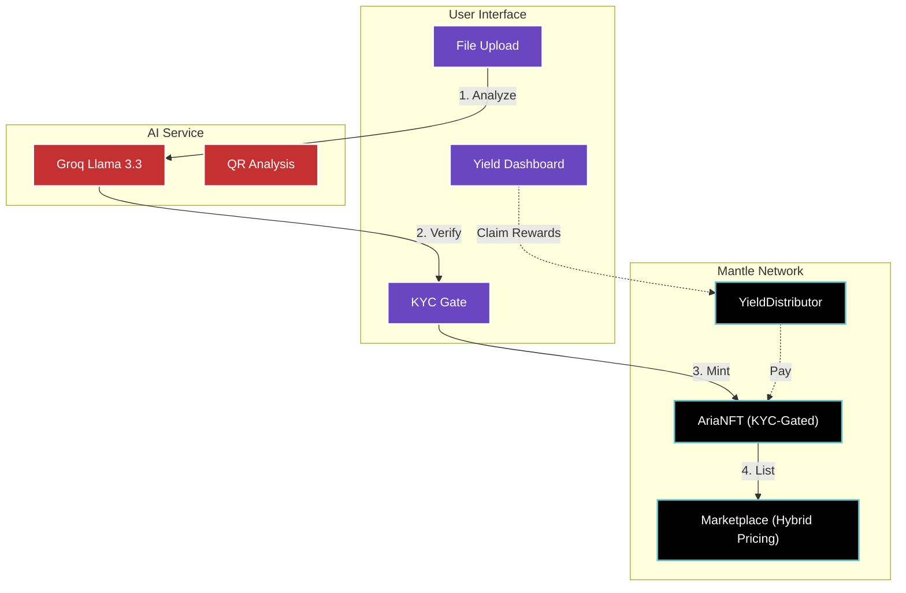
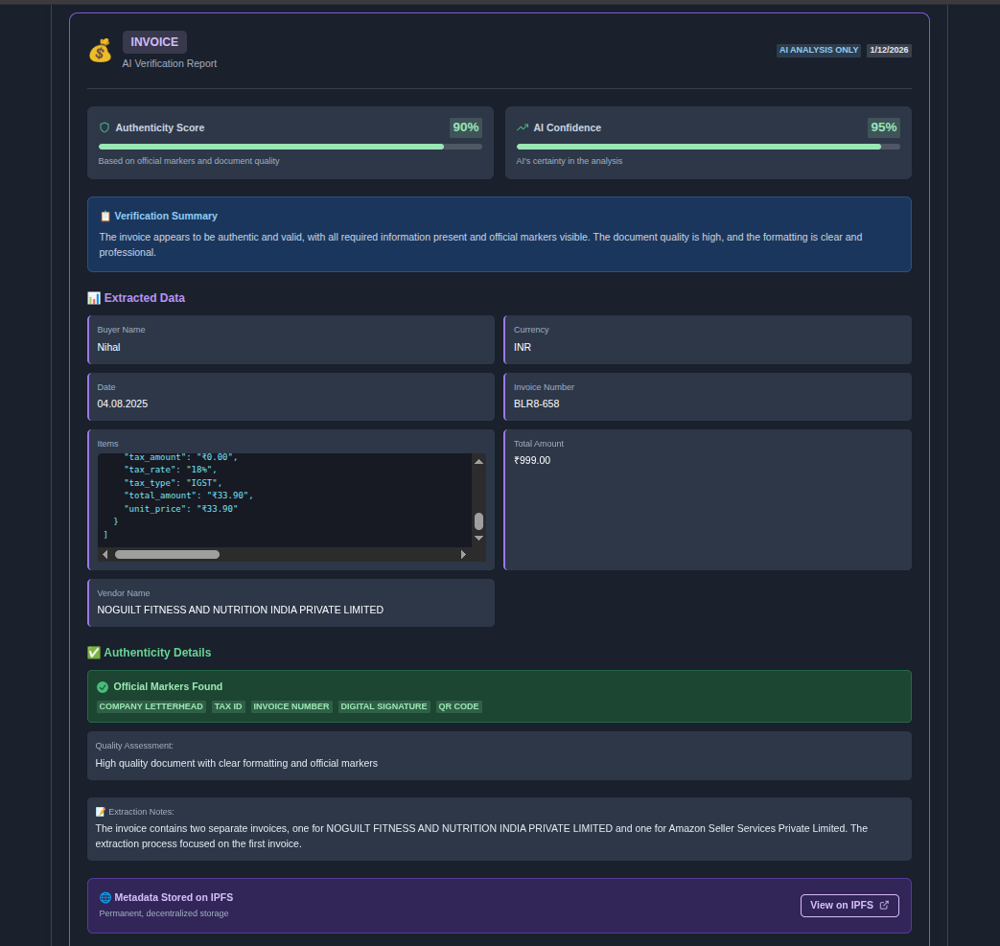
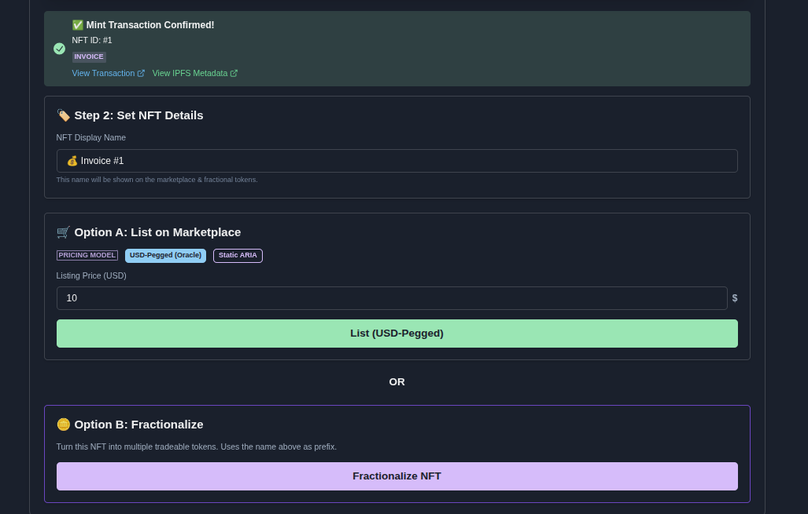
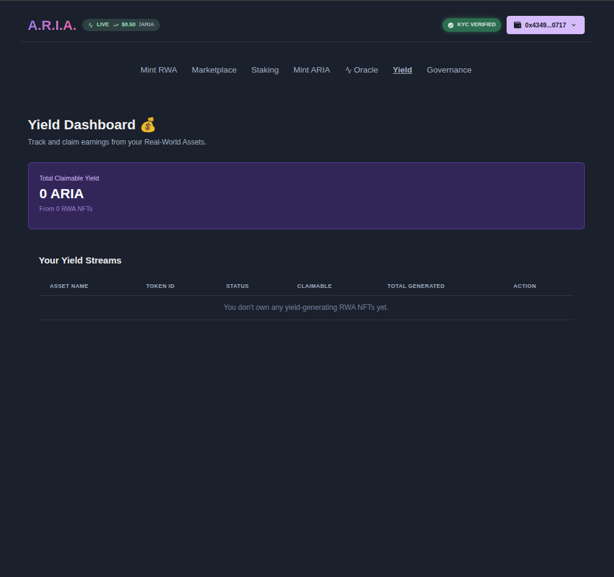

# A.R.I.A. - Automated RWA Intelligence & Authentication

## Mantle Global Hackathon 2025 🏆

<p align="center">
  
  
  
  <br/>
  <a href="https://www.youtube.com/watch?v=DoiVuKCWqmI">
    
  </a>
</p>

**The world's first AI-powered multi-document RWA verification platform**  
_Verify ANY document. Tokenize ANY asset. Earn yield. All on Mantle._

### 🎯 Why Mantle?

- ⚡ **25,000+ TPS** - Instant RWA trading
- 💰 **$0.01 Gas Fees** - 5000x cheaper than Ethereum
- 🔥 **3-Second Finality** - Near-instant settlement
- 🛡️ **EVM Compatible** - Easy enterprise integration

### 🏆 Track: RWA / RealFi

Unlocking the $2 trillion real-world asset market with AI verification,
compliance-ready tokenization, and native yield distribution.

---

<details open>
<summary><strong>🎯 The Problem We're Solving</strong></summary>

## 🎯 The Problem We're Solving

The **$2 Trillion+ Real-World Asset (RWA)** market faces critical challenges:

- 📄 **Manual Verification Crisis** - Takes 3-14 days and costs $10-$1000 per document
- 🚫 **Centralized Trust Issues** - Relies on intermediaries and paper trails
- 💸 **Illiquidity Trap** - No native venues for trading tokenized assets
- ⚠️ **Fraud Risk** - $50 billion lost annually to document fraud

**A.R.I.A. leverages Mantle's high-performance modular L2 to eliminate these bottlenecks.**

</details>

---

<details>
<summary><strong>💡 Our Solution (Mantle Optimized)</strong></summary>

## 💡 Our Solution

A.R.I.A. is a **complete end-to-end protocol** that transforms real-world documents into verified, liquid, tradeable NFTs on Mantle Network. We deliver:

### 🤖 **Multi-Document AI Verification (Groq Llama 3.3)**

Support for **8+ document types** with automatic AI classification:

- 💰 Invoices & Receipts
- 🏠 Property Deeds
- 🚗 Vehicle Registrations
- 🎓 Certificates & Degrees

### ⚡ **Built on Mantle Network**

- **Modular Architecture**: Leverages Mantle DA for low-cost metadata availability.
- **Unbeatable Speed**: Instant confirmations for high-frequency RWA trading.
- **Near-Zero Fees**: Minting an RWA NFT costs fractions of a cent.

### 🛡️ **Tier 1 Regulatory Compliance (New)**

- **Native KYC Gates**: `AriaNFT.sol` enforces identity verification before minting.
- **Investor Classes**: Retail, Verified, and Accredited investor tiers.
- **Fraud Detection**: AI flags suspicious modifications or future-dates.

### 💰 **Yield Distribution Engine (New)**

- **Real-World Yield**: Distribute rental income or invoice payments directly to NFT holders.
- **Claim Dashboard**: Simple UI for holders to claim ETH/MNT rewards.

</details>

---

<details>
<summary><strong>🏗️ Technical Architecture</strong></summary>

## 🏗️ Technical Architecture

### **System Flow Diagram**



### **Technology Stack**

#### **Frontend**

- **Framework**: React 18 + Vite
- **UI Library**: Chakra UI
- **Wallet**: MetaMask / Mantle Wallet support

#### **Backend**

- **Language**: Python (Flask)
- **AI**: Groq API (Llama 3.3 70B)
- **Blockchain**: Web3.py

#### **Smart Contracts (Mantle)**

- **Language**: Solidity 0.8.20
- **Core Contracts**:
  - `AriaNFT.sol`: ERC721 with `onlyKYCVerified` modifier.
  - `YieldDistributor.sol`: Handles ETH/MNT payout streams.
  - `Marketplace.sol`: Supports static and USD-pegged (Oracle) pricing.
  - `MockOracle.sol`: Simulates Chainlink feeds on Mantle Testnet.

</details>

---

<details>
<summary><strong>🚀 Getting Started</strong></summary>

## 🚀 Getting Started

### **Prerequisites**

- Node.js 18+ & Python 3.9+
- Mantle Wallet (MetaMask configured for Chain ID 5003)

### **Installation**

#### **1. Clone & Setup**

```bash
git clone https://github.com/Nihal-Pandey-2302/ARIA-Mantle.git
cd ARIA-Mantle
```

#### **2. Install Dependencies**

```bash
# Backend
cd backend
python3 -m venv venv
source venv/bin/activate
pip install -r requirements.txt

# Frontend
cd ../frontend
npm install
```

#### **3. Deploy to Mantle Testnet**

```bash
cd ../contracts
# Create .env with PRIVATE_KEY
npx hardhat run scripts/deploy.js --network mantleTestnet
```

#### **4. Run Application**

```bash
# Starts both Backend (Port 5001) and Frontend (Port 5173) components
./run.sh
```

</details>

---

<details>
<summary><strong>🆕 Mantle Hackathon Features</strong></summary>

## 🆕 Mantle Hackathon Features (Tier 1 & 2)

### 1. **Native KYC/AML Integration** 🆔

A.R.I.A. on Mantle includes a strict compliance layer.

- **How it works**: Users self-attest via the `KYCGate` component.
- **On-Chain**: The `AriaNFT` contract checks `kycStatus[msg.sender]` before allowing any minting transaction.
- **Privacy**: Identity docs are hashed via IPFS (simulated for demo).

### 2. **RWA Yield Distribution** 💸

Real-world assets generate cash flow. A.R.I.A. makes it claimable on-chain.

- **YieldDistributor**: A pull-payment contract where asset managers deposit yield.
- **Instant Claims**: NFT holders visit the **Yield Dashboard** to withdraw their share in $MNT or $ETH.

### 3. **Oracle-Powered Hybrid Pricing** 🔮

Sellers can list assets in USD, preventing crypto-volatility risk.

- **MockOracle**: We deployed a custom Oracle on Mantle Testnet since Chainlink feeds are Mainnet-only.
- **Dynamic Conversion**: Buyers pay the real-time $MNT equivalent of the USD price.

</details>

---

<details>
<summary><strong>🧪 Testing Guide</strong></summary>

## 🧪 Testing Guide

### **Manual Flow**

1. **Connect Wallet**: Switch to Mantle Testnet.
2. **KYC Check**: Click "Verify Identity" in the header. (Required to Mint)
3. **Upload**: Select "Invoice" and upload a PDF.
4. **Mint**: Create your verifiable RWA NFT.
5. **Yield**: Go to `/yield` to see simulated earnings from your asset.

</details>

---

---

## 📸 Application Screenshots

### 1. Dashboard & AI Analysis


_The main dashboard where users verify identity and start the minting flow._


_AI-generated valuation report before minting._

### 2. Marketplace & Listing


_Listing verified RWAs with hybrid usage of USD or ARIA pricing._

### 3. Yield Dashboard


_Tracking real-time yield generation from RWA assets._

### 4. Governance


_Community governance portal for disputing suspicious assets._

---

## 📜 Deployed Contracts (Mantle Testnet)

| Contract             | Address                                      |
| -------------------- | -------------------------------------------- |
| Contract             | Address                                      |
| -------------------- | -------------------------------------------- |
| **AriaToken**        | `0xf37F527E7b50A07Fa7fd49D595132a1f2fDC5f98` |
| **AriaNFT**          | `0xD504D75D5ebfaBEfF8d35658e85bbc52CC66d880` |
| **Marketplace**      | `0x13056D2af56AFb98d924FC8146B8E0aa2C8B67d7` |
| **YieldDistributor** | `0x047100C5357497bFC8Ecc6846E65BC7bDb4d35f9` |
| **FractionalNFT**    | `0x3e2B64f8d927447C370CD6a84FAdf92f6B95C806` |
| **MockOracle**       | `0x85B5F81f2581Ae8BbC1353F55456EF00aD67993B` |

---

## Team

### Nihal Pandey - Founder & Lead Engineer

- **Education**: Electronics Engineering, RGIPT (2022-2026)
- **Experience**:
  - Cybersecurity Research Intern, PMO Govt. of India (2025)
  - Winner: aOS Andromeda Hackathon ($2,500 prize, 1st/2500 teams)
  - Winner: Smart India Hackathon 2024 (₹100K prize)
- **Expertise**: Rust, Solidity, EVM internals, cybersecurity
- **Why ARIA**: "I saw a $2T market trapped in manual processes. ARIA combines my blockchain and security background to fix it."

---

**Built with ❤️ by Nihal Pandey for the Mantle Global Hackathon.**
